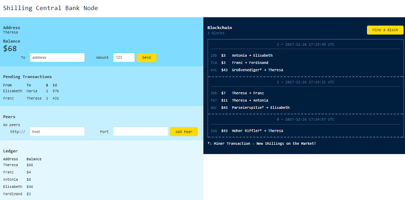

# shilling (or schilling) command line tool (and core library)

shilling (or schilling) on the blockchain! rock-solid alpine dollar from austria;
print (mine) your own shillings; run your own federated shilling central bank nodes
w/ public distributed (hyper) ledger book on the blockchain peer-to-peer over HTTP; revolutionize the world one block at a time with cryptos


* home  :: [github.com/bitshilling/bitshilling.tools](https://github.com/bitshilling/bitshilling.tools)
* bugs  :: [github.com/bitshilling/bitshilling.tools/issues](https://github.com/bitshilling/bitshilling.tools/issues)
* gem   :: [rubygems.org/gems/shilling](https://rubygems.org/gems/shilling)
* rdoc  :: [rubydoc.info/gems/shilling](http://rubydoc.info/gems/shilling)


## Command Line

Use the `shilling` command line tool. Try:

```
$ shilling -h     
```

resulting in:

```
Usage: shilling [options]

  Wallet options:
    -n, --name=NAME                  Address name (default: Theresa)

  Server (node) options:
    -o, --host HOST                  listen on HOST (default: 0.0.0.0)
    -p, --port PORT                  use PORT (default: 4567)
    -h, --help                       Prints this help
```

To start a new (network) node using the default wallet
address (that is, Theresa) and the default server host and port settings
use:

```
$ shilling
```

Stand back ten feets :-) while starting up the machinery.
Ready to print (mine) shillings on the blockchain?
In your browser open up the page e.g. `http://localhost:4567`. Voila!




Note: You can start a second node on your computer -
make sure to use a different port (use the `-p/--port` option)
and (recommended)
a different wallet address (use the `-n/--name` option).
Example:

```
$ shilling -p 5678 -n Franz
```

Happy mining!


## Local Development Setup

For local development - clone or download (and unzip) the shilling.tools code repo.
Next install all dependencies using bundler with a Gemfile e.g.:

``` ruby
# Gemfile

source "https://rubygems.org"

gem 'sinatra'
gem 'sass'
gem 'blockchain-lite'
gem 'ledger-lite'
```

run

```
$ bundle       ## will use the Gemfile (see above)
```

and now you're ready to run your own shilling server node. Use the [`config.ru`](config.ru) script for rack:

``` ruby
# config.ru

$LOAD_PATH << './lib'

require 'shilling'

run Shilling::Service
```

and startup the money printing machine using rackup - the rack command line tool:

```
$ rackup       ## will use the config.ru - rackup configuration script (see above).
```

In your browser open up the page e.g. `http://localhost:9292`. Voila! Happy mining!


## License


The `shilling` scripts are dedicated to the public domain.
Use it as you please with no restrictions whatsoever.
