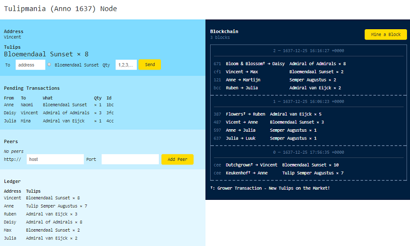

# tulipmania (anno 1673) library / gem and command line tool


tulips on the blockchain; learn by example from the real world (anno 1637) - buy! sell! hodl! enjoy the beauty of admiral of admirals, semper augustus, and more;
run your own hyper ledger tulip exchange nodes on the blockchain peer-to-peer over HTTP; revolutionize the world one block at a time


* home  :: [github.com/openblockchains/tulipmania](https://github.com/openblockchains/tulipmania)
* bugs  :: [github.com/openblockchains/tulipmania/issues](https://github.com/openblockchains/tulipmania/issues)
* gem   :: [rubygems.org/gems/tulipmania](https://rubygems.org/gems/tulipmania)
* rdoc  :: [rubydoc.info/gems/tulipmania](http://rubydoc.info/gems/tulipmania)


## Command Line

Use the `tulipmania` command line tool. Try:

```
$ tulipmania -h     
```

resulting in:

```
Usage: tulipmania [options]

  Wallet options:
    -n, --name=NAME                  Address name (default: Anne)

  Server (node) options:
    -o, --host HOST                  listen on HOST (default: 0.0.0.0)
    -p, --port PORT                  use PORT (default: 4567)
    -h, --help                       Prints this help
```

To start a new (network) node using the default wallet
address (that is, Anne) and the default server host and port settings
use:

```
$ tulipmania
```

Stand back ten feets :-) while starting up the machinery.
Ready to exchange tulips on the blockchain?
In your browser open up the page e.g. `http://localhost:4567`. Voila!




Note: You can start a second node on your computer -
make sure to use a different port (use the `-p/--port` option)
and (recommended)
a different wallet address (use the `-n/--name` option).
Example:

```
$ tulipmania -p 5678 -n Vincent
```

Happy mining!


## Local Development Setup

For local development - clone or download (and unzip) the tulipmania code repo.
Next install all dependencies using bundler with a Gemfile e.g.:

``` ruby
# Gemfile

source "https://rubygems.org"

gem 'sinatra'
gem 'sass'
gem 'blockchain-lite'
```

run

```
$ bundle       ## will use the Gemfile (see above)
```

and now you're ready to run your own tulipmania server node. Use the [`config.ru`](config.ru) script for rack:

``` ruby
# config.ru

$LOAD_PATH << './lib'

require 'tulipmania'

run Tulipmania::Service
```

and startup the tulip exchange machinery using rackup - the rack command line tool:

```
$ rackup       ## will use the config.ru - rackup configuration script (see above).
```

In your browser open up the page e.g. `http://localhost:9292`. Voila! Happy mining!


## References

[**Programming Cryptocurrencies and Blockchains (in Ruby)**](http://yukimotopress.github.io/blockchains) by Gerald Bauer et al, 2018, Yuki & Moto Press


## License


The `tulipmania` scripts are dedicated to the public domain.
Use it as you please with no restrictions whatsoever.
